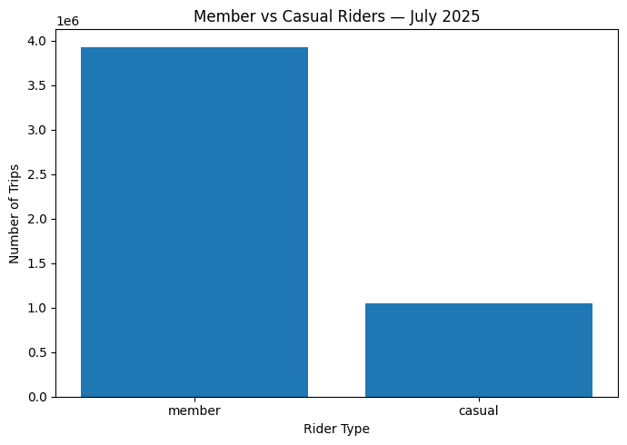
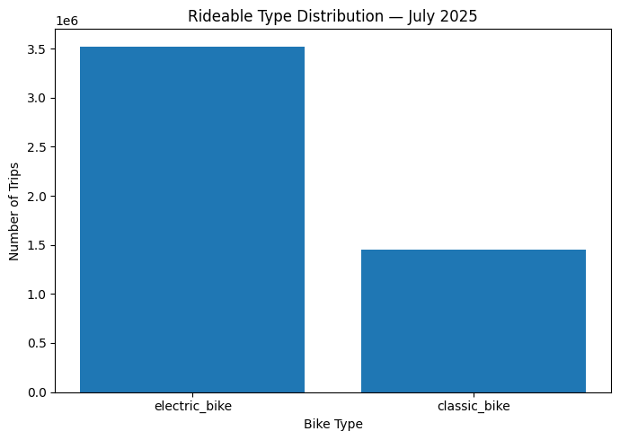
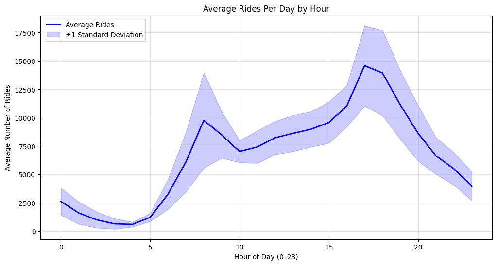
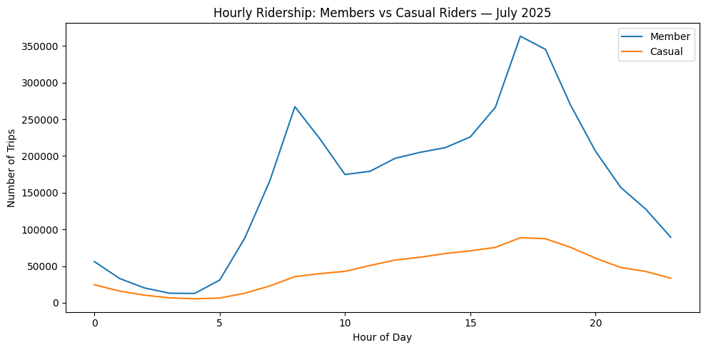
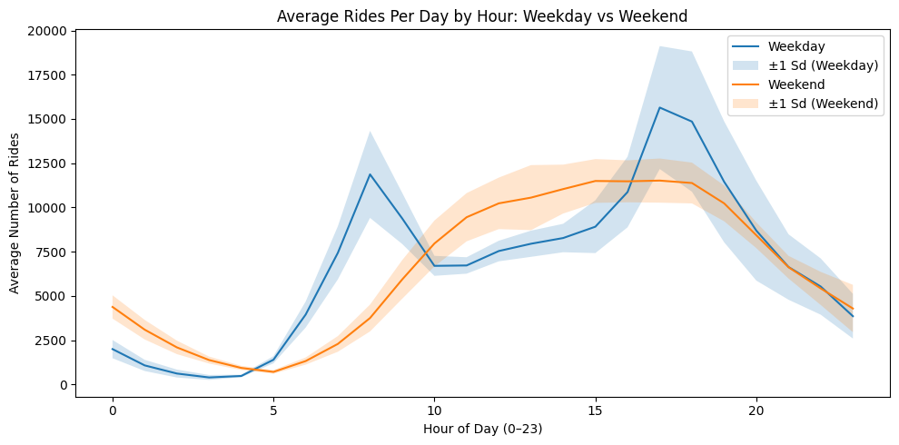
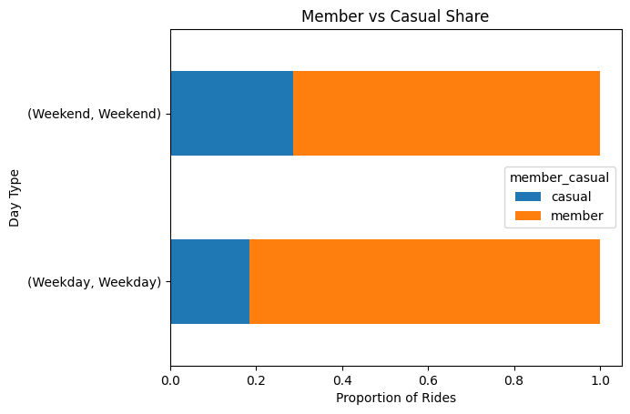
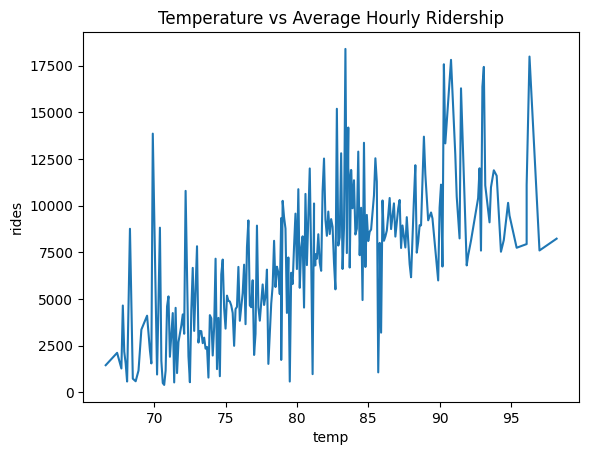
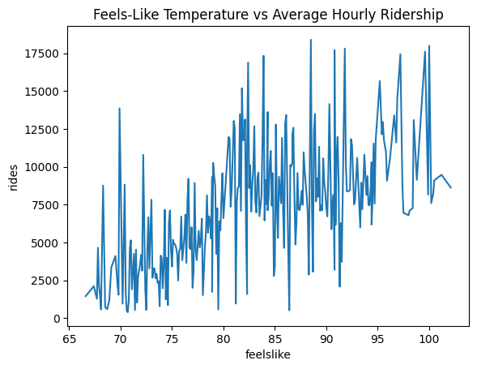

# NYC-Citibike_Weather_Analysis

## 1. Project Summary

### This project investigates the correlation between hourly weather conditions and Citi Bike ridership patterns in New York City during July 2025. By integrating high-volume trip data with granular meteorological observations, the study aims to identify the specific "tipping points" where weather factors (such as precipitation thresholds and "feels like" temperatures) cause significant shifts in transit behavior across different user demographics.

## 2. Data Sources

### 1) NYC Citi Bike Trip Data  ---> contains individual ride records for July 2025. Each row represents a single trip with fields mentioned below:

| Field | Description |
|-------|-------------|
| **ride_id** | Unique identifier for each trip |
| **rideable_type** | Type of bike used (Electric bike / Classic bike) |
| **started_at** | Trip start timestamp in **MM/DD/YYYY hh:mm:ss AM/PM** format |
| **ended_at** | Trip end timestamp in **MM/DD/YYYY hh:mm:ss AM/PM** format |
| **start_station_name** | Station name in *"[Street Name] & [Cross Street/Avenue]"* format |
| **start_station_id** | Unique identifier for the start station |
| **end_station_name** | Station name in *"[Street Name] & [Cross Street/Avenue]"* format |
| **end_station_id** | Unique identifier for the end station |
| **start_lat** | Latitude of the start location |
| **start_lng** | Longitude of the start location |
| **end_lat** | Latitude of the end location |
| **end_lng** | Longitude of the end location |
| **member_casual** | Rider type (Member / Casual) |

 ### Link to the dataset: [Link](https://citibikenyc.com/system-data)

### 2) Visual Crossing Weather API  ---> provides hourly weather observations for New York City from **July 1–31, 2025**. Each hourly record includes:

| Field | Description |
|-------|-------------|
| **date** | Date of the weather observation (YYYY‑MM‑DD) |
| **hour** | Hour of the day (0–23) |
| **temp** | Temperature (°F) |
| **feelslike** | Feels‑like temperature (°F) |
| **precip** | Precipitation amount (inches) |
| **cloudcover** | Cloud cover percentage (0–100) |
| **conditions** | General weather description (e.g., Clear, Partially cloudy, Rain) |

### Link to the dataset: [Link](https://www.visualcrossing.com/weather-data/)

## Why july 2025 Was Chosen?
July 2025 was selected because it provides a high‑volume, weather‑rich month for analyzing Citi Bike usage patterns. Ridership is at its summer peak, giving strong hourly signal strength across both member and casual riders. The month includes a natural mix of clear skies, overcast periods, heat waves, and multiple rain events, offering enough variation to observe how temperature, precipitation, and sky conditions influence rider behavior. July also avoids major winter disruptions and holiday‑driven anomalies, and both the Citi Bike trip data and hourly weather data are fully available and well‑aligned. These factors make July 2025 an ideal month for studying how weather affects real‑world bike‑share activity.

## 3. ETL Pipeline

### Extraction: 

Citi Bike Trip Data:

* Pulled all July 2025 Citi Bike CSV files from the folder using glob.
* Loaded each file in 200,000‑row chunks so the notebook can handle millions of rows without running out of memory.
* While reading each chunk, station IDs were kept as strings to avoid type issues.

Weather Data:

* Loaded the July 2025 weather file (NYC_Weather_July2025.txt) which is a nested JSON format.
* Extracted the "days" list and then looped through each day and each hour to build a flat table of date, hour, temperature, feels‑like temperature, precipitation, cloud cover, conditions.

### Transformation:

Citi Bike Trip Data:

* Converted 'started_at' and 'ended_at' into proper datetime values.
* Removed rows with missing or invalid timestamps.
* Calculated trip duration and kept only trips between **1 minute and 3 hours**.
* Filtered the dataset to include only trips from **July 2025**.
* Extracted 'date' and 'hour' from the start time for merging with weather data.

Weather Data:

* Converted the weather 'date' field into a proper date object.
* Ensured the hour field was numeric and matched the trip data format.

Hourly Aggregation:

* Grouped trips by 'date' and 'hour' to compute hourly ride counts.
* This produced a separate dataset used specifically for weather‑vs‑ridership analysis.

## 4. EDA

### Member vs Casual Riders

This chart highlights the overall usage split between member and casual riders. Members account for roughly 4 times more trips than casual riders during July 2025.

### Electric vs Classic Bike Usage

Electric bikes were chosen far more frequently, with usage roughly 3 times higher than classic bikes. 

### Average Rides Per Day by Hour

This line chart shows the typical daily rhythm of Citi Bike usage. There are two clear peaks: one in the morning and one in the late afternoon. These peaks line up with standard commuting hours, indicating that a large portion of rides come from people using Citi Bike as part of their workday travel. The lowest activity occurs overnight, especially around 3-4 AM.

### Hourly Ridership: Members vs Casual Riders

When hourly patterns are separated by rider type, the differences become more obvious. Members show strong morning and evening peaks, which is consistent with commuting behavior. Casual riders, on the other hand, ride more steadily throughout the day and peak in the late afternoon, which aligns with leisure, tourism, and weekend activity. This contrast is important for understanding how weather affects each group differently.

### Average Rides on Weekdays/Weekends by Hour

The weekday curve shows two clear peaks-one in the morning around 8 AM and another in the late afternoon around 5-6 PM reflecting typical commuter behavior. In contrast, weekend ridership rises more gradually, reaching a broad afternoon peak between 1-5 PM, which aligns with leisure and recreational use. Overall, weekdays are driven by work-related travel, while weekends show a smoother, more flexible riding pattern centered around midday activity.

### Member vs Casual on Weekdays/Weekends

Members make up the majority of rides on both weekdays and weekends, but their dominance is especially strong during weekdays. Casual riders account for a noticeably larger share on weekends, reflecting more recreational and tourist-driven activity. Overall, the chart shows that weekday ridership is driven primarily by members-consistent with routine commuting-while weekends see a relative increase in casual usage tied to leisure trips.

## Correlation Matrix

|              | rides     | temp      | feelslike | precip    | cloudcover |
|--------------|-----------|-----------|-----------|-----------|-------------|
| **rides**        | 1.000000 | 0.500014  | 0.480934  | -0.064069 | 0.005051    |
| **temp**         | 0.500014 | 1.000000  | 0.973074  | -0.066726 | -0.213480   |
| **feelslike**    | 0.480934 | 0.973074  | 1.000000  | -0.064511 | -0.182463   |
| **precip**       | -0.064069| -0.066726 | -0.064511 | 1.000000  | 0.102702    |
| **cloudcover**   | 0.005051 | -0.213480 | -0.182463 | 0.102702  | 1.000000    |

Temperature has a strong positive effect on ridership, meaning warmer hours consistently lead to more rides. Precipitation shows a large negative coefficient, 
indicating that rainfall reduces ridership, although the effect can vary depending on intensity and duration. Cloud cover has a small positive effect, 
suggesting that overcast conditions slightly increase ridership, possibly because riders avoid direct sun or heat. Overall, the model shows how 
different weather factors contribute to changes in hourly ride volume.

## 5. Questions

### 1) How does precipitation affect hourly ridership?

Rain was very rare in July, with only about 6.85% of hours showing any precipitation. Because there were so few rainy hours, the dataset doesn’t have enough variation to reliably measure how rain affects hourly ridership. Any patterns or negative trends should be viewed cautiously since the sample of rainy conditions is too small to draw strong conclusions.

### 2) Member vs Casual Proportions by Cloud Condition

| Cloud Condition | Casual | Member |
|----------------|--------|--------|
| **Clear**          | 0.210625 | 0.789375 |
| **Partly Cloudy**  | 0.212718 | 0.787282 |
| **Overcast**       | 0.206744 | 0.793256 |

The proportions stay almost the same across all cloud conditions. Members consistently make up about 79% of rides, while casual riders stay around 21%. This means cloud cover does not meaningfully change riding behavior for either group - both members and casual riders ride at similar rates whether the sky is clear, partly cloudy, or overcast.

A chi‑square test of independence found a statistically significant association between cloud cover and rider type (p = 0.0). However, the actual differences in proportions were extremely small (≈21% casual vs 79% member across all cloud conditions). Given the large sample size, the test detects trivial differences that are not practically meaningful. Therefore, cloud cover does not meaningfully change the distribution of member vs casual riders.

### 3) Is there a noticeable “tipping point” where temperature or feels‑like temperature causes ridership to drop?

Ridership keeps increasing as temperature rises, and there’s no point where it suddenly drops. July never gets hot enough to show any tipping point.

Temperature and hourly ridership were moderately positively correlated (r = 0.48, p < 0.001). This indicates that ridership increases as temperature rises, and the relationship is statistically significant.

 

### 4) Which weather variable (temperature, precipitation, cloud cover) has the strongest impact on riders?

Temperature has the strongest impact on ridership, as seen clearly in the correlation matrix where temperature shows the highest positive correlation with rides.

Pearson correlation tests were used to compare the strength of association between ridership and each weather variable. Temperature showed a moderate positive correlation with ridership (r ≈ 0.48, p < 0.001), making it the strongest predictor. Feels‑like temperature showed a similar significant positive correlation. In contrast, precipitation (r = –0.064, p = 0.081) and cloud cover (r = 0.005, p = 0.891) showed no statistically significant relationship with ridership. Therefore, temperature is the only weather variable with a meaningful impact on ridership.

### 5) Are casual riders more sensitive to weather changes than members?

#### Correlation with Hourly Rides

| Variable      | Casual Riders | Member Riders |
|---------------|---------------|----------------|
| **temp**      | 0.4871        | 0.4806         |
| **feelslike** | 0.4506        | 0.4670         |
| **precip**    | -0.0750       | -0.0582        |
| **cloudcover**| -0.0118       | 0.0093         |

Casual and member riders show nearly identical weather sensitivity - the correlations are almost the same, so casual riders are not more sensitive to weather changes.

Fisher r‑to‑z tests were used to compare weather sensitivity between casual and member riders. Temperature, feels‑like temperature, precipitation, and cloud cover all showed no statistically significant differences between the two groups, as the correlations were nearly identical across rider types. This indicates that casual and member riders respond to weather conditions in essentially the same way, with warmer temperatures increasing ridership similarly for both groups and adverse conditions like precipitation or cloud cover reducing ridership to a comparable degree.

### 6) How do weather conditions influence peak commuting hours compared to midday leisure hours?

#### Correlation with Hourly Rides

| Variable      | Commute Hours | Midday Hours |
|---------------|---------------|--------------|
| **temp**      | 0.5764        | 0.5336       |
| **feelslike** | 0.5896        | 0.5019       |
| **precip**    | -0.1232       | -0.0655      |
| **cloudcover**| -0.1682       | 0.0328       |

Weather influences commuting hours more strongly than midday leisure hours, with higher temperature sensitivity and stronger negative effects from precipitation and cloud cover during commute periods.

Fisher r‑to‑z tests were used to compare weather sensitivity between commute hours and midday hours. Temperature, feels‑like temperature, and precipitation showed no statistically significant differences between the two periods (all p > 0.14), indicating similar effects across the day. Cloud cover was the only variable with a significant difference (z = –2.38, p = 0.017), showing a stronger negative impact during commute hours. This suggests that overcast conditions reduce commuter ridership more than midday leisure ridership.
